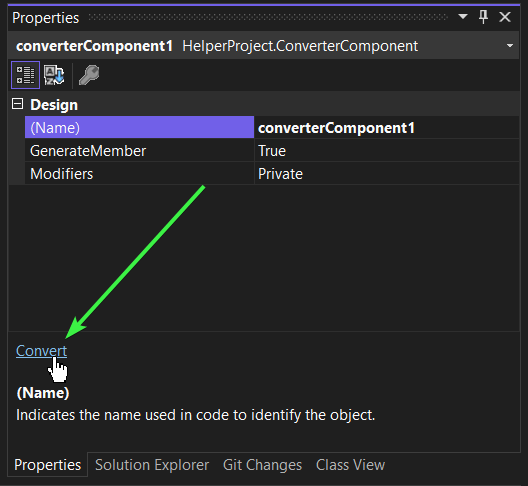

<!-- default badges list -->

<!-- default badges end -->
# How to Migrate VSREPX Reports to CS / VB Format

## Overview

The '.vsrepx' report format has evolved from an attempt to adapt Visual Studio Report Designer for.NET Core projects.

Since v21.2, we introduced `.cs` / `.vb` format support for our Visual Studio Designer for .NET Core and .NET 5+. The VSREPX format became obsolete, and we recommend the CS/VB format in Visual Studio.

The obsolete `.vsrepx' format does not include some features introduced later, such as inheritance support and custom controls. To take advantage of all our new features, you must use the CS/VB format.

## How to Convert Multiple Reports From the Legacy VSREPX format to CS / VB Format

This project contains sample code that can be used to convert several VSREPX files in a Visual Studio project into CS or VB report files. We advise you to study the suggested code, modify it if necessary, and use the code in your application.

To convert files, do the following:

1. Download the project files and give writing permissions to files and folders within the project.
2. Use [Project Converter](https://docs.devexpress.com/ProjectConverter/2529/project-converter) to convert solutions to the version that is installed on your machine.
3. Open the `ConvertVSRepx2Cs.sln` file.
4. Add your VSREPX files to the `ClassLibrary1` project in the solution.
4. Build the solution.
5. Open the `HostComponent` component in the Visual Studio and  select the `converterComponent1` item in the designer.
7. Open the **Properties** window for the  `converterComponent1` item, and click the `Convert` action link:

    

The Visual Studio Designer attempts to load a VSREPX file in the `ClassLibrary1` project, converts a report to CS (VB) format, and saves the file to the `Layout` folder. There is no progress indicator, so you should wait for several minutes.

The name of the project that the converter searches for VSREPX files, is specified by the `ProjectName` variable in the `Program.cs` file. 

## Files to Review
- [Program.cs](cs/HelperProject/Program.cs) (VB: [Program.vb](vb/HelperProject/Program.vb))
- [ConverterComponent.cs](cs/HelperProject/ConverterComponent.cs) (VB: [ConverterComponent.vb](vb/HelperProject/ConverterComponent.vb))

## Documentation

- [Report File Formats (CS/VB and VSREPX)](https://docs.devexpress.com/XtraReports/404375/visual-studio-report-designer/report-file-formats-cs-vb-and-vsrepx)

<!-- feedback -->
## Does this example address your development requirements/objectives?

 

(you will be redirected to DevExpress.com to submit your response)
<!-- feedback end -->
